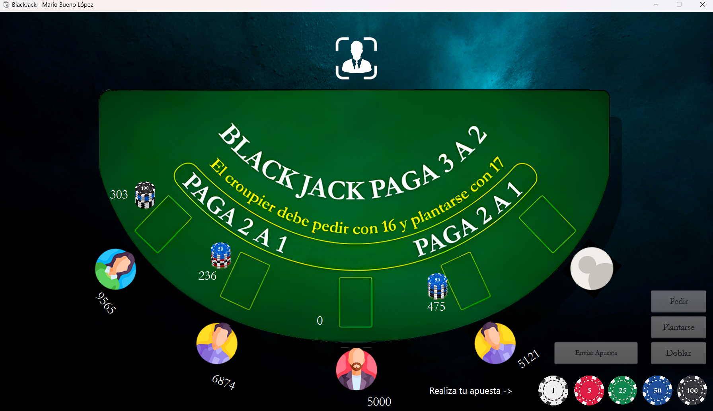

# 🎲 Blackjack Game

<p align="center">
  
</p>

## Descripción

Bienvenido a mi juego de Blackjack desarrollado en Java con JavaFX. Este proyecto ofrece una experiencia de juego clásica y visualmente atractiva del famoso juego de cartas Blackjack. Juega contra el crupier y trata de conseguir 21 sin pasarte.

## Características

- 🃏 **Interfaz de usuario intuitiva**: Diseñada con JavaFX para una experiencia visual atractiva.
- 🤖 **IA del crupier**: El crupier juega siguiendo las reglas estándar del Blackjack.
- 📊 **Historial de partidas**: Mantén un registro de tus victorias y derrotas.

## Capturas de Pantalla

<p align="center">
  
  <br>
  <em>Pantalla de Inicio</em>
</p>

<p align="center">
  
  <br>
  <em>Selección de Idioma</em>
</p>

<p align="center">
  
  <br>
  <em>Nombre y Avatar</em>
</p>

<p align="center">
  
  <br>
  <em>Juego en Progreso</em>
</p>

## Requisitos del Sistema

- Java 11 o superior
- JavaFX SDK

## Instalación

1. **Clona el repositorio**
    ```sh
    git clone https://github.com/Maarioo25/BlackJack.git
    ```
2. **Importa el proyecto en tu IDE favorito**
    - Asegúrate de que tu IDE esté configurado para trabajar con Java y JavaFX.

3. **Añade JavaFX a tu proyecto**
    - Configura las librerías de JavaFX en tu IDE. Puedes descargar JavaFX desde [Gluon](https://gluonhq.com/products/javafx/).

4. **Ejecuta la aplicación**
    - Ejecuta la clase principal `MainApp.java`.

## Uso:

1. **Inicia el juego**: Haz clic en "Iniciar".
2. **Selecciona tu idioma**: Selecciona el idioma en el que prefieras jugar.
3. **Nombre y Avatar**: Selecciona tu Nombre y tu Avatar preferido.
4. **Comenzar juego**: Haz clic en el botón "Jugar".
5. **Haz tu apuesta**: Selecciona la cantidad de fichas que deseas apostar.
6. **Juega tus cartas**: Decide si deseas "Pedir", "Plantarte" o "Doblar" para doblar tu apuesta. ).
7. **Gana o pierde**: El objetivo es acercarse lo más posible a 21 sin pasarte y tener una mano mejor que la del crupier.

## Contribuciones

¡Contribuciones son bienvenidas! Siéntete libre de abrir un issue o enviar un pull request.

## Contacto

- **Nombre:** Mario Bueno López
- **Email:** maarioo2525@gmail.com
- **GitHub:** [Maarioo25](https://github.com/Maarioo25)

---

¡Gracias por jugar! 🎉
